# Simple maps in Python

 - **Authors**: Nancy Soontiens
 - **Research field**: Oceanography
 - **Lesson Topic**: Generating maps with Basemap

The lesson outlines some simple techniques for mapping in Python using the
Matplotlib Basemap Toolkit.

**Resources**
* https://peak5390.wordpress.com/2012/12/08/matplotlib-basemap-tutorial-making-a-simple-map/
* http://matplotlib.org/basemap/index.html
* https://basemaptutorial.readthedocs.org/en/latest/

## Set up

Instructions for installing Basemap can be found here.
* http://matplotlib.org/basemap/users/installing.html

To work through this lesson, you will also need the matplotlib, numpy and pandas
libraries. All of these are installed with the Anaconda Python distribution.
* http://continuum.io/downloads

To get started, load some useful libraries, including matplotlib.pyplot, numpy
and Basemap.


    from mpl_toolkits.basemap import Basemap
    import matplotlib.pyplot as plt
    import numpy as np
    
    %matplotlib inline

Create a Basemap class instance. This object has access to a bunch of functions
in the Basemap class. An example is a function that draws the coastlines.


    map = Basemap()
    
    map.drawcoastlines()
    plt.show()


We have used the default settings for there creation of the Basemap class
instance. There are many, many options listed in the Basemap documentation. Some
we will consider next include:

* the projection
* the centering latitude and longitude (lat_0, lon_0)
* the resolution (or quality) of the image. For world maps, a low resolution
will suffice.
* the threshold area that specifies the size of islands/lakes that should be
plotted (area_thres)

A list of available map projections can be found here:
* http://matplotlib.org/basemap/users/mapsetup.html


    ####
    map = Basemap(projection='ortho', lat_0=50, lon_0=-100,
                  resolution='l', area_thresh=1000.0)
    ####
    
    map.drawcoastlines()
    plt.show()


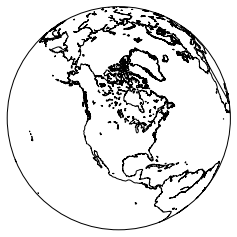


Add borders with drawcountries().


    map = Basemap(projection='ortho', lat_0=50, lon_0=-100,
                  resolution='l', area_thresh=1000.0)
     
    map.drawcoastlines()
    ####
    map.drawcountries()
    ####
    
    plt.show()


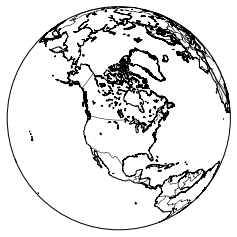


Color the continents with fillcontinents().


    map = Basemap(projection='ortho', lat_0=50, lon_0=-100,
                  resolution='l', area_thresh=1000.0)
     
    map.drawcoastlines()
    map.drawcountries()
    ####
    map.fillcontinents(color='coral')
    ####
    
    plt.show()


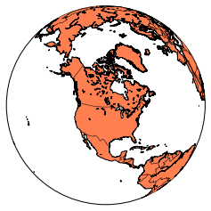


Add meridians and parallels with drawmeridians() and drawparallels().


    map = Basemap(projection='ortho', lat_0=50, lon_0=-100,
                  resolution='l', area_thresh=1000.0)
     
    map.drawcoastlines()
    map.drawcountries()
    map.fillcontinents(color='coral')
     
    ####
    map.drawmeridians(np.arange(0, 360, 30))
    map.drawparallels(np.arange(-90, 90, 30))
    #### 
    
    plt.show()


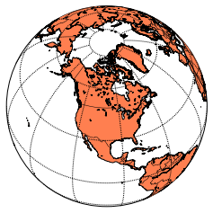


Try a different view by changing lat_0 and lon_0.


    map = Basemap(projection='ortho', lat_0=0, lon_0=-100,
                  resolution='l', area_thresh=1000.0)
     
    map.drawcoastlines()
    map.drawcountries()
    map.fillcontinents(color='coral')
     
    map.drawmeridians(np.arange(0, 360, 30))
    map.drawparallels(np.arange(-90, 90, 30))
     
    plt.show()


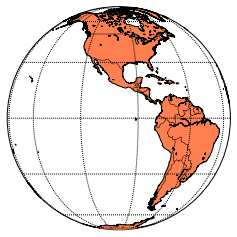


Try a different projection.


    ####
    map = Basemap(projection='robin', lat_0=0, lon_0=-100,
                  resolution='l', area_thresh=1000.0)
    #### 
    map.drawcoastlines()
    map.drawcountries()
    map.fillcontinents(color='coral')
     
    map.drawmeridians(np.arange(0, 360, 30))
    map.drawparallels(np.arange(-90, 90, 30))
     
    plt.show()


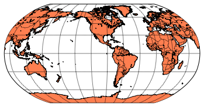


## Zooming

We would like to zoom in on an area of interest. Use a mercator projection and
* llcrnrlon (lower left corner longitude)
* llcrnrlat (lower left corner latitude)
* urcrnrlon (upper right corner longitude)
* urcrnrlat( upper right corner latitude)

In this example, we will zoom in on the Salish Sea and Vancouver Island.


    fig = plt.figure(figsize=(10,10))
    map = Basemap(projection='merc', lat_0=49, lon_0=-123,
        resolution = 'l', area_thresh = 1000,
        llcrnrlon=-127, llcrnrlat=47,
        urcrnrlon=-122, urcrnrlat=51)
     
    map.drawcoastlines()
    map.drawcountries()
    map.fillcontinents(color='burlywood')
    
    plt.show()


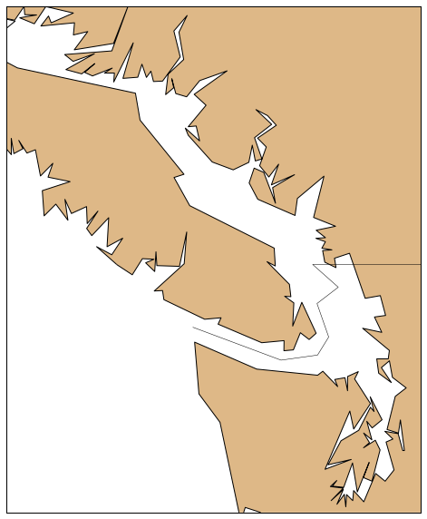


Increase the resolution.


    fig = plt.figure(figsize=(10,10))
    ####
    map = Basemap(projection='merc', lat_0=49, lon_0=-123,
        resolution = 'h', area_thresh = 1000,
        llcrnrlon=-127, llcrnrlat=47,
        urcrnrlon=-122, urcrnrlat=51)
    ####
    
    map.drawcoastlines()
    map.drawcountries()
    map.fillcontinents(color='burlywood')
    
     
    plt.show()


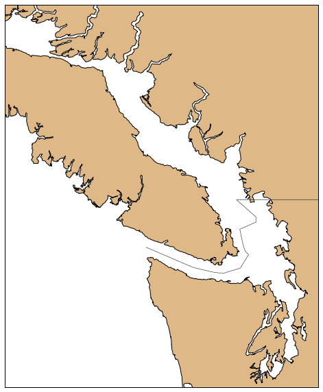


Draw more islands and lakes by decreasing the area_thres argument.


    fig = plt.figure(figsize=(10,10))
    ####
    map = Basemap(projection='merc', lat_0=49, lon_0=-123,
        resolution = 'h', area_thresh = 0.1,
        llcrnrlon=-127, llcrnrlat=47,
        urcrnrlon=-122, urcrnrlat=51)
    ####
    
    map.drawcoastlines()
    map.fillcontinents(color='burlywood')
    map.drawcountries()
    
     
    plt.show()


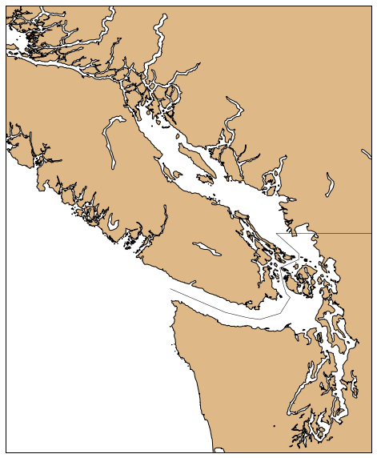


Plot major rivers.


    fig = plt.figure(figsize=(10,10))
    map = Basemap(projection='merc', lat_0=49, lon_0=-123,
        resolution = 'h', area_thresh = 0.1,
        llcrnrlon=-127, llcrnrlat=47,
        urcrnrlon=-122, urcrnrlat=51)
     
    map.drawcoastlines()
    map.fillcontinents(color='burlywood')
    ####
    map.drawrivers(color='b',linewidth=1.5)
    ####
     
    plt.show()


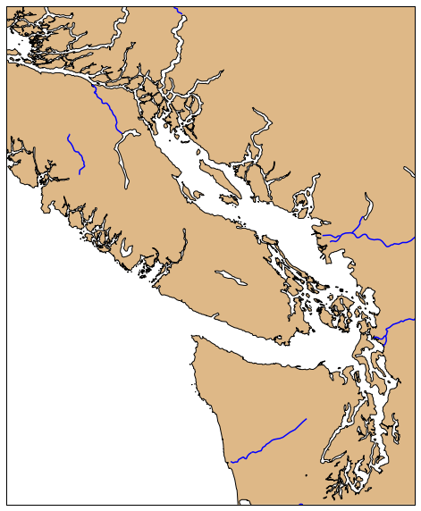


Add meridians and parallels with labels.
* in drawmeridian() and drawparallels() setting labels =[1,0,0,1] adds labels on
the left and bottom axis.

```
    fig = plt.figure(figsize=(10,10))
    map = Basemap(projection='merc', lat_0=49, lon_0=-123,
        resolution = 'h', area_thresh = 0.1,
        llcrnrlon=-127, llcrnrlat=47,
        urcrnrlon=-122, urcrnrlat=51)
     
    map.drawcoastlines()
    map.fillcontinents(color='burlywood')
    map.drawrivers(color='b',linewidth=1)
    
    ####
    map.drawmeridians([-127, -125, -123], labels=[1,0,0,1])
    map.drawparallels([47, 49, 51],labels=[1,0,0,1])
    ####
    
    plt.show()
```

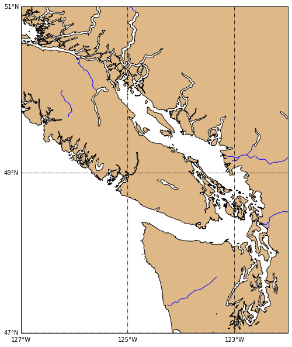


### Challenge

Add labels to the left, right, bottom and top axis in the above plot.

### Solution


    fig = plt.figure(figsize=(10,10))
    map = Basemap(projection='merc', lat_0=49, lon_0=-123,
        resolution = 'h', area_thresh = 0.1,
        llcrnrlon=-127, llcrnrlat=47,
        urcrnrlon=-122, urcrnrlat=51)
     
    map.drawcoastlines()
    map.fillcontinents(color='burlywood')
    map.drawrivers(color='b',linewidth=1)
    
    map.drawmeridians([-127, -125, -123], labels=[1,1,1,1])
    map.drawparallels([47, 49, 51],labels=[1,1,1,1])
    
    plt.show()


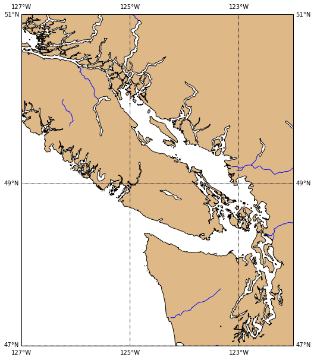


Add marker for a city. Knowing the longitude/latitude of the city is not enough.
We have to translate the longitude/latitude into projection coordinates.

This is done simply by passing the desired longitude/latitude as arguments to
the Basemap class instance.


    Van_lon = -123.1207
    Van_lat = 49.2827
    
    x,y = map(Van_lon, Van_lat)
    
    print x,y

    431358.275813 380466.053658
    


Now add it to the plot.


    fig = plt.figure(figsize=(10,10))
    map = Basemap(projection='merc', lat_0=49, lon_0=-123,
        resolution = 'h', area_thresh = 0.1,
        llcrnrlon=-127, llcrnrlat=47,
        urcrnrlon=-122, urcrnrlat=51)
     
    map.drawcoastlines()
    map.fillcontinents(color='burlywood')
    map.drawrivers(color='b',linewidth=1)
    
    
    map.drawmeridians([-127, -125, -123], labels=[1,0,0,1], dashes=[2,2])
    map.drawparallels([47, 49, 51],labels=[1,0,0,1], dashes=[2,2])
    
    ####
    Van_lon = -123.1207
    Van_lat = 49.2827
    
    x,y = map(Van_lon, Van_lat)
    map.plot(x, y, 'r*', markersize=24)
    ####
    
    plt.show()


Add a label to the city using a matplotlib.pyplot function annotate().


    fig = plt.figure(figsize=(10,10))
    map = Basemap(projection='merc', lat_0=49, lon_0=-123,
        resolution = 'h', area_thresh = 0.1,
        llcrnrlon=-127, llcrnrlat=47,
        urcrnrlon=-122, urcrnrlat=51)
     
    map.drawcoastlines()
    map.fillcontinents(color='burlywood')
    map.drawrivers(color='b',linewidth=1)
    
    
    map.drawmeridians([-127, -125, -123], labels=[1,0,0,1], dashes=[2,2])
    map.drawparallels([47, 49, 51],labels=[1,0,0,1], dashes=[2,2])
    
    Van_lon = -123.1207
    Van_lat = 49.2827
    
    x,y = map(Van_lon, Van_lat)
    map.plot(x, y, 'r*', markersize=24)
    
    ####
    plt.annotate('Vancouver',xy=(x,y),xytext=(10,10),textcoords='offset points',fontsize=16)
    ####
    
    plt.show()


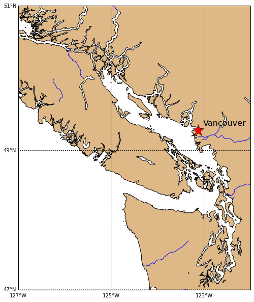


### Challenge

Draw a map with your hometown marked and labelled.

## Adding data

Sometimes we want to add our own data to a map. Next, we will work through
adding an ocean model particle trajectory to our map. The trajectory data is
stored in a file called traj.txt. We will load this data using pandas.

Note: details on the ocean model that generate this trajectory can be found
here:

* http://salishsea.eos.ubc.ca/nemo/index.html

```
    import pandas as pd
    
    fname = 'traj.txt'
    data=pd.read_csv(fname,delimiter=' ', names=['num','lon','lat','depth','age'])
    
    lons = np.array(data['lon'])
    lats=np.array(data['lat'])
    
    print lons, lats
    [-123.25558 -123.23922 -123.18216 -123.39746 -123.69411 -123.96874
     -124.17054 -124.33354 -124.394   -124.46454] [ 48.61595  48.59781  48.36028  48.30912  48.27558  48.35421  48.4103
      48.47167  48.50298  48.51483]
```


### Challenge

Translate the arrays lons, lats into projection coordinates.

### Solution


    xs,ys=map(lons, lats)
    print xs, ys

    [ 416360.31116904  418179.45931234  424524.23883903  400583.98240553
      367598.02294898  337060.57462418  314621.44899354  296496.68448513
      289773.84238588  281930.15595384] [ 267571.67553976  264521.14834066  224677.38937363  216120.05138331
      210514.59836432  223661.63453078  233052.35698136  243338.944077
      248591.79063342  250580.69936743]
    

Add the particle trajectory to the map with the Basemap method plot().


    fig = plt.figure(figsize=(10,10))
    map = Basemap(projection='merc', lat_0=49, lon_0=-123,
        resolution = 'h', area_thresh = 0.1,
        llcrnrlon=-125, llcrnrlat=48,
        urcrnrlon=-122, urcrnrlat=50)
     
    map.drawcoastlines()
    map.fillcontinents(color='burlywood')
    map.drawrivers(color='b',linewidth=1)
    
    Van_lon = -123.1207
    Van_lat = 49.2827
    
    x,y = map(Van_lon, Van_lat)
    map.plot(x, y, 'r*', markersize=24)
    plt.annotate('Vancouver',xy=(x,y),xytext=(10,10),textcoords='offset points',fontsize=16)
    
    ####
    xs,ys=map(lons, lats)
    map.plot(xs,ys,'o-')
    ####
    
    plt.show()


## Contoured data

Data can be more complicated than simple points. We can add more complicated
gridded data with Basemap contour() functions. Some examples of data that might
be plotted this way include sea surface temperature, sea surface salinity, or
sea surface height.

I don't have any data like this readily available, so we will generate fake
data.


    fig = plt.figure(figsize=(10,10))
    map = Basemap(projection='merc', lat_0=49, lon_0=-123,
        resolution = 'h', area_thresh = 0.1,
        llcrnrlon=-125, llcrnrlat=48,
        urcrnrlon=-122, urcrnrlat=50)
     
    map.drawcoastlines()
    map.fillcontinents(color='burlywood')
    
    
    #make up some data
    lons = np.arange(-125,-121.9,.1)
    lats = np.arange(48,50.1, .1)
    longrid,latgrid = np.meshgrid(lons,lats)
    pert = 0.005*np.random.rand(longrid.shape[0],longrid.shape[1])
    data = np.sin(latgrid*np.pi/180)*np.cos(longrid*np.pi/180) +pert
    
    #plot it
    x, y = map(longrid, latgrid)
    cs=map.contour(x,y,data, 15,linewidths=2)
    
    plt.show()


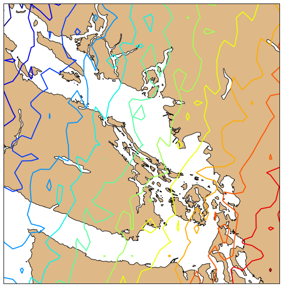


### Challenge

Replicate the above plot with filled contours.

### Solution


    fig = plt.figure(figsize=(10,10))
    map = Basemap(projection='merc', lat_0=49, lon_0=-123,
        resolution = 'h', area_thresh = 0.1,
        llcrnrlon=-125, llcrnrlat=48,
        urcrnrlon=-122, urcrnrlat=50)
     
    map.drawcoastlines()
    map.fillcontinents(color='burlywood')
    
    
    #make up some data
    lons = np.arange(-125,-121.9,.1)
    lats = np.arange(48,50.1, .1)
    longrid,latgrid = np.meshgrid(lons,lats)
    pert = 0.005*np.random.rand(longrid.shape[0],longrid.shape[1])
    data = np.sin(latgrid*np.pi/180)*np.cos(longrid*np.pi/180) +pert
    
    #plot it
    x, y = map(longrid, latgrid)
    cs=map.contourf(x,y,data, 15)
    


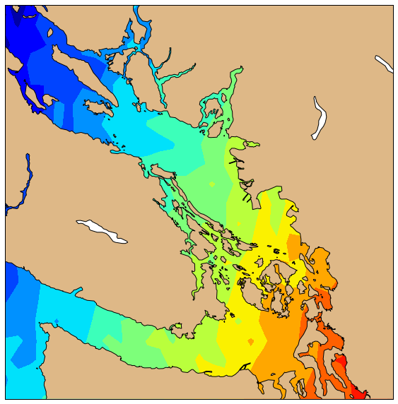


There are many other Basemap methods for adding data to your maps. Browse
through the Basemap documentation for more details.


    
